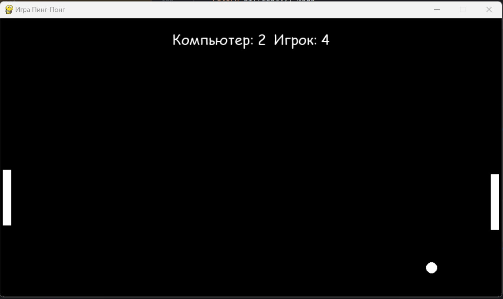

# Игра Пинг-Понг на Pygame

## Описание
Проект "Игра Пинг-Понг" - это классическая аркадная игра, реализованная с использованием библиотеки Pygame. Игра поддерживает игру одного игрока против компьютера или двух игроков.

## Функции
- **Режимы игры**: Игра поддерживает два режима:
  1. Игра с компьютером.
  2. Игра с другим игроком.
- **Выбор сложности**: Игрок может выбрать один из трех уровней сложности перед началом игры.
- **Интерактивные управления**: Используйте клавиши стрелок и W, S для управления ракетками.
- **Перезапуск игры**: Игру можно перезапустить после пропущенного шара, нажав на клавишу "Пробел".
- **Выход из игры**: Выход из игры осуществляется через нажатие клавиши "Esc".

## Как начать игру
1. Убедитесь, что у вас установлен Python и Pygame.
2. Загрузите файлы игры на ваш компьютер.
3. Запустите файл игры через вашу IDE или из командной строки: `python имя_файла.py`.
4. Выберите режим игры и сложность на стартовом экране.
5. Нажмите Enter для начала игры.

## Скриншот

## Требования
- Python 3.x
- Pygame

## Разработчик
Разработано - Харитоновым Ю.С.

## Лицензия
Игра распространяется по лицензии MIT.